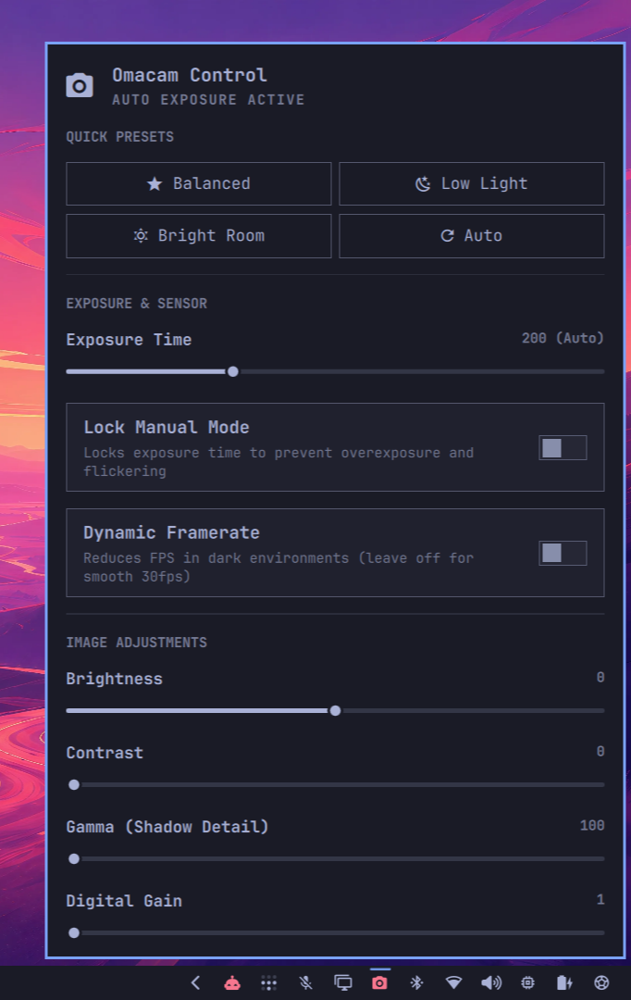

<div align="center">

# 📷 Omacam Control

**Native, lightweight V4L2 webcam sensor calibration, exposure controls, and hardware privacy killswitch for Omarchy Quattro.**

[](https://plugins.omarchy.org)
[](LICENSE)
[](https://github.com/kevinbsr/omacam-control)

<br />



</div>

---

## 🎯 Overview

Most Linux webcam utilities either rely on heavy GUI suites or load multimedia frameworks (`QtMultimedia`, GStreamer) into the desktop shell. On hybrid graphics laptops (e.g. AMD iGPU + NVIDIA dGPU), opening media pipelines keeps the dedicated GPU awake, burning ~10W of battery at idle.

**Omacam Control** is designed from scratch to be **100% battery-safe, ultra-lightweight, and native**:
- Directly adjusts V4L2 hardware sensor registers without touching the dGPU.
- **Appears on-demand** in the bar only when an application (Google Meet, Discord, Teams, Zoom, OBS, Snapshot) starts capturing video.
- Provides studio-grade lighting and exposure calibration in real time.
- Features a **one-click hardware privacy shutter**.

---

## ✨ Features

- 🟢 **On-Demand Auto-Show & Auto-Hide:** Automatically appears on the bar when camera capture starts and cleanly disappears when idle.
- 🔋 **Zero dGPU Power Drain:** Built without `QtMultimedia`. Hybrid laptops safely maintain `D3cold` sleep state.
- ⚡ **Physical Privacy Killswitch:** Right-click the bar icon to instantly cut power to the USB webcam at the kernel level (`authorized = 0`), powering down sensor and LED across all active calls.
- 🎛️ **Live Hardware Sensor Controls:**
  - **Exposure Time & Lock Manual Mode:** Eliminate camera blowout, flickering, and motion blur.
  - **Dynamic Framerate:** Toggle low-light adaptive framerate.
  - **Image Adjustments:** Sliders for Brightness, Contrast, Gamma (shadow detail recovery), Digital Gain, and Backlight Compensation.
- 🌟 **One-Click Quick Presets (2x2 Grid):**
  - `󰓎 Balanced`: Studio-calibrated natural lighting, shadow recovery, and stable 30fps lock.
  - `󰖔 Low Light`: High digital gain, increased gamma, and extended sensor exposure.
  - `󰖙 Bright Room`: Lowered exposure and reduced gain to prevent washed-out backgrounds.
  - `󰑐 Auto`: Restores hardware auto-exposure and default sensor defaults.

---

## 🖱️ Bar Controls & Shortcuts

| Action | Result |
| :--- | :--- |
| **Left-Click** on `󰄀` | Opens / closes the Omacam Control calibration panel. |
| **Right-Click** on `󰄀` | Toggles **Privacy Shutter** (turns icon to `󰗟` and cuts hardware video feed). |
| **Wheel Scroll on Sliders** | Passes through smoothly to scroll the panel without accidentally altering values. |

---

## 📦 Requirements

- **Omarchy Quattro** (`omarchy-shell` / `quickshell`)
- **V4L2 utilities:**
  ```bash
  sudo pacman -S v4l-utils
  ```

---

## 🚀 Installation

### Via Omarchy CLI:

```bash
omarchy plugin add https://github.com/kevinbsr/omacam-control
```

### Manual Installation:

1. Clone this repository into your Omarchy plugins directory:
   ```bash
   git clone https://github.com/kevinbsr/omacam-control.git ~/.config/omarchy/plugins/kevin.camera
   ```

2. Add the widget to your `~/.config/omarchy/shell.json` inside `bar.layout.right`:
   ```json
   {
     "id": "kevin.camera"
   }
   ```

3. Restart the shell:
   ```bash
   omarchy restart shell
   ```

---

## 💻 CLI & IPC Control

You can trigger Omacam Control actions directly from scripts, keybindings, or Hyprland config:

```bash
# Toggle the settings panel
omarchy-shell shell toggle kevin.camera

# Apply presets via CLI
python3 ~/.config/omarchy/plugins/kevin.camera/camera_ctl.py preset balanced
python3 ~/.config/omarchy/plugins/kevin.camera/camera_ctl.py preset night
python3 ~/.config/omarchy/plugins/kevin.camera/camera_ctl.py preset bright
python3 ~/.config/omarchy/plugins/kevin.camera/camera_ctl.py preset auto

# Toggle hardware privacy killswitch
python3 ~/.config/omarchy/plugins/kevin.camera/camera_ctl.py privacy 1 # Block
python3 ~/.config/omarchy/plugins/kevin.camera/camera_ctl.py privacy 0 # Unblock
```

---

## 📜 License

Distributed under the [MIT License](LICENSE). Copyright © 2026 Kevin.
